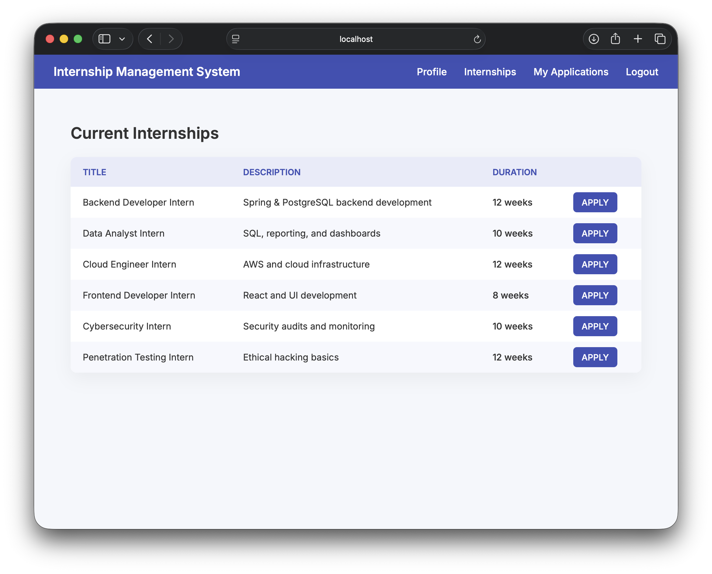
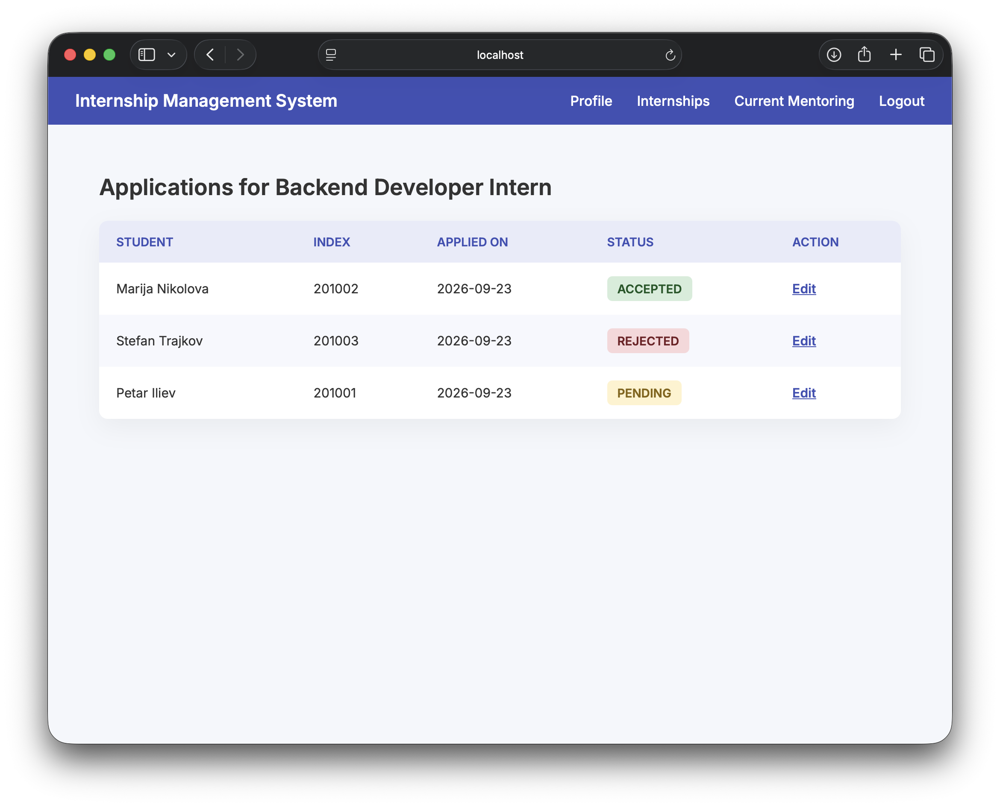
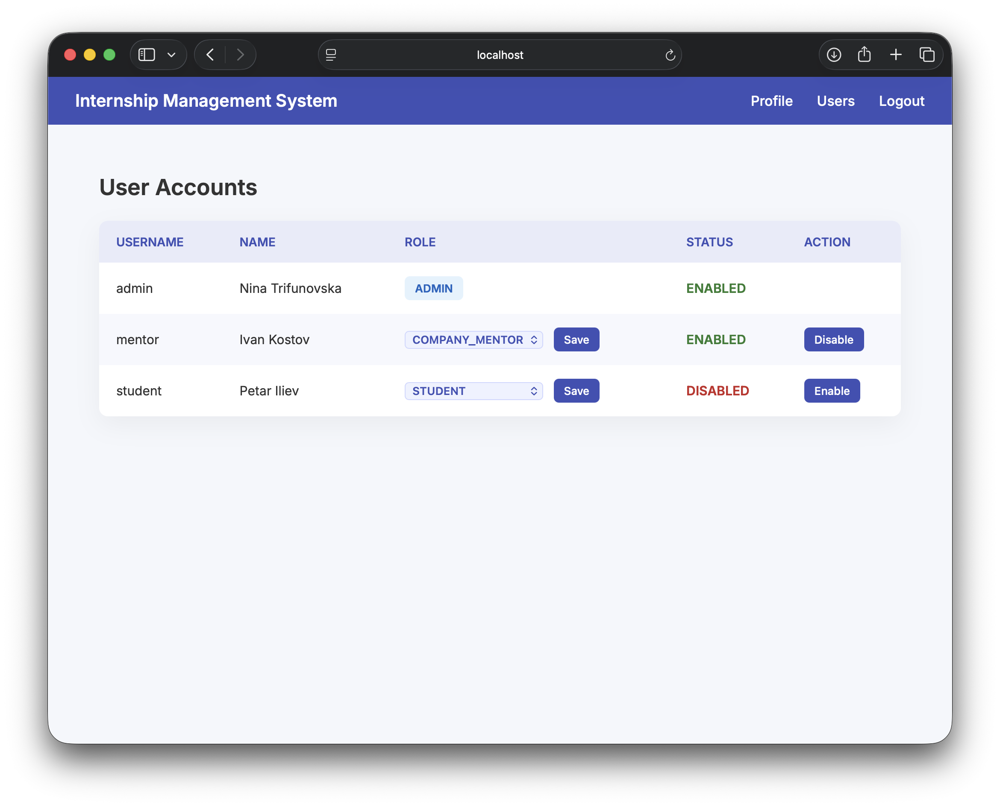

# Internship Management System

A system for managing internships, student applications, and role-based workflows in an academic–industry environment.

The system is built using Spring Boot, Spring Security, Thymeleaf, and PostgreSQL with strict role-based access control (RBAC).

---

## Technology Stack

[](https://www.java.com/)
[](https://spring.io/projects/spring-boot)
[](https://spring.io/projects/spring-security)
[](https://www.thymeleaf.org/)
[](https://www.postgresql.org/)
[](https://www.docker.com/)

---

## Architecture Overview

The underlying database schema is designed and maintained separately in the [internship-management-database](https://github.com/trifunovskanina/internship-management-database) repository.

The application validates the schema at startup and enforces business rules and access control on top of it.

---

## Project Structure

```text
internship-management-system/
│
├── src/
│   ├── main/
│   │   ├── java/com/trifunovska/internship/
│   │   │   ├── config/             
│   │   │   ├── dto/                 
│   │   │   ├── model/               
│   │   │   ├── repository/       
│   │   │   ├── service/             
│   │   │   └── web/                
│   │   │
│   │   └── resources/
│   │       ├── templates/            
│   │       │   └── fragments/        
│   │       └── application.properties
│   │
│   └── test/                       
│
├── database/
│   ├── diagrams/                   
│   └── sql/
│       ├── init/                     
│       ├── dynamic/                 
│       └── reports/                  
│
├── Dockerfile                        
├── docker-compose.yml              
├── pom.xml                           
├── mvnw                            
├── mvnw.cmd
├── .gitignore
└── README.md
```

---

## Security Model

Authentication and authorization are handled using Spring Security with a custom UserDetailsService.

The system enforces Role-Based Access Control (RBAC) at the controller and service layers.  

Authorization is always enforced server-side and is never inferred from UI navigation alone.

---

## Supported Roles

| Role | Description |
|-----|------------|
| Student | View available internships, apply for internships, submit required documents, and track application statuses |
| Company Mentor | View internships they mentor, review student applications, and update application statuses |
| Admin | Manage users, assign roles, activate/deactivate accounts, and view user profiles via DTOs |

---

## Core Features

- Internship listing and application submission
- Document upload and persistence
- Application review and status management
- Role-based dashboards and workflows
- Admin user and role management
- DTO-based profile views
- Strong database integrity enforcement
- Fully containerized runtime environment

---

## Demo Accounts

The application includes predefined demo users for evaluation and testing purposes.
These accounts are intended for local development and demonstration only.

| Role | Username | Password |
|------|----------|----------|
| Student | student | student |
| Company Mentor | mentor | mentor |
| Admin | admin | admin |

---

## Demonstration


<div align="center"> 
    
    
    
    
</div>

---

## Running the Project
```
docker compose up --build
```
